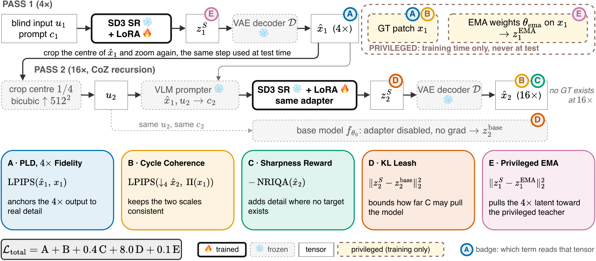

# OracleZoom

> **Anonymous version for double-blind review.** Author names, affiliations, and all
> repository, model, and dataset links are replaced with `XXXX`. Because of this, the
> download and data-preparation commands below cannot run as written. Everything else,
> including all training and evaluation code, is complete and unmodified.

**Zoom into a photo 256 times, and keep the new detail honest.**

A normal 4x super-resolution model, run again and again, reaches huge zoom levels. But past 4x
there is nothing left to recover, so the model has to **invent** detail. Most methods then invent
detail that looks sharp but is not really there.

OracleZoom makes the invented detail match reality more closely. It is a small set of extra
weights (an *adapter*) added to a model that is otherwise left untouched: **7.1M trained weights**,
learned from **1,000 images**.

<p align="center"></p>

| | |
|---|---|
| 🤗 Model | https://huggingface.co/XXXX/OracleZoom |
| 🤗 Training data | https://huggingface.co/datasets/XXXX/OPDZoom-4KLSDB-train |
| 🌐 Project page | https://XXXX.github.io/OracleZoom/ |

---

## 1. Install

You need one NVIDIA GPU and Python 3.10 or newer. Everything runs on a single GPU.

```bash
git clone --recursive https://github.com/XXXX/OracleZoom.git
cd OracleZoom
uv sync                      # or: pip install -e .
```

Then get the two things the model needs:

```bash
# 1. our adapter (7.1M parameters, small)
huggingface-cli download XXXX/OracleZoom --local-dir weights/oraclezoom

# 2. the Chain-of-Zoom checkpoints it sits on top of
#    put SR_LoRA, SR_VAE and VLM_LoRA inside ref/coz/ckpt/
#    see https://github.com/bryanswkim/Chain-of-Zoom
```

The main Stable Diffusion 3 model downloads by itself the first time you run.

## 2. Zoom into your own images

```bash
python -m opd_zoom.teacher.oracle_infer --mode student \
  --pld_lora weights/oraclezoom \
  --gt_dir my_images/ --out out/ --rec_num 4 --upscale 4
```

You get four folders:

| Folder | Zoom |
|---|---|
| `out/scale1` | 4x |
| `out/scale2` | 16x |
| `out/scale3` | 64x |
| `out/scale4` | 256x |

Each input image is cut to a 512x512 square in the middle, then zoomed four times. Every zoom step
costs the same time, because each step goes back to 512x512 before zooming again.

**That is all you need to use the model.** The rest of this page is for reproducing our numbers.

---

## 3. Results

**CLIPIQA** rates how good an image looks on its own, with nothing to compare against. Higher is
better. **LPIPS** and **DISTS** measure how far the result is from the real image, so they only work
at 4x. Lower is better.

| Method | CLIPIQA (mean) | LPIPS @4x | DISTS @4x | CLIPIQA @256x |
|---|---|---|---|---|
| HiT-SR | 0.418 | 0.341 | 0.222 | 0.490 |
| MambaIR | 0.431 | 0.343 | 0.224 | 0.502 |
| SwinIR | 0.458 | 0.228 | 0.175 | 0.462 |
| SeeSR | 0.546 | 0.216 | 0.164 | 0.507 |
| OSEDiff | 0.579 | 0.336 | 0.228 | 0.530 |
| Chain-of-Zoom | 0.617 | 0.216 | 0.170 | 0.576 |
| **OracleZoom** | **0.711** | **0.199** | **0.160** | **0.707** |

Mean over 6 test sets (4KLSDB, DIV8K, DRealSR, FFHQ, Flickr2K, RealSR) and 4x to 256x. Every
method runs inside the same zoom loop and is scored by the same code, so the comparison is fair.

Past 4x there is no correct answer to compare against. So we also asked two vision-language models
to judge. Both prefer our images. The main judge picks ours **68 to 78% of the time** at 64x and
256x, and finds **2 to 5 times less invented detail** than Chain-of-Zoom.

See [REPRODUCE.md](REPRODUCE.md) for the exact settings and commands.

---

## 4. How it works

The adapter is trained with five parts. Only the first one has a real answer to copy.

<p align="center"></p>

| | Part | What it does |
|---|---|---|
| A | 4x fidelity | Match the real high-resolution image. This is the only zoom level where a true answer exists. |
| B | Cycle coherence | Zoom to 16x, shrink it back by 4, and check it still matches where it came from. |
| C | Sharpness reward | Ask for more detail past 4x, where no answer exists. |
| D | KL leash | Do not drift far from the original model. This stops part C from cheating. |
| E | Slow-copy teacher | A slow average of the adapter gives a second, calmer target at 4x. |

**Why part D matters most.** A sharpness score cannot tell real detail from invented detail. If we
remove part D, the model gets the **best sharpness score** of any setting we tried, and also
invents the **most** fake detail. Sharper and less true at the same time. Part D prevents that.

**What "privileged" means.** During training only, a teacher is allowed to see the real
high-resolution image. The student never sees it. At test time nothing is privileged.

---

## 5. Train it yourself

**Step 1: get the data.** It downloads from HuggingFace. No manual setup.

```bash
export HF_TOKEN=hf_...        # or: huggingface-cli login
python scripts/prepare_data.py --tier 1k --out data/train_1k --eval_layout data/eval_val
```

This downloads the images and their cached prompts, then builds the low-quality inputs the model
trains on. Use `--tier 1k` for the paper setting. `4k`, `16k` and `all` are also available.

**Step 2: train.**

```bash
scripts/train_final.sh data/train_1k data/train_1k/train_list.txt data/train_1k_val out/run1
```

The command shows all five weights, so you can read the settings instead of trusting defaults.
Training stops on its own when validation stops improving. Our run stopped near 9,300 steps.

If a run stops early, add `--resume` to continue from exactly where it left off. The optimizer,
step count, data order, random state, and slow-copy weights are all saved.

## 6. Score it

The `--eval_layout` folder from step 1 works right away, with nothing else to download:

```bash
scripts/eval_final.sh data/eval_val renders/ours results/ours
```

To score Chain-of-Zoom through the same pipeline, add `blind` at the end.

For the six test sets in the paper (DIV8K, DRealSR, RealSR, Flickr2K, FFHQ, 4KLSDB) you need the
datasets themselves, which are not ours to share:

```bash
export OPDZ_ROOT=/where/your/datasets/are
python scripts/prep_eval_datasets.py div8k_1238
scripts/eval_final.sh $OPDZ_ROOT/data/eval/div8k_1238 renders/ours results/ours
```

**Note:** full-reference scores (LPIPS, DISTS) only appear at 4x. Deeper there is no real image to
compare against, so we do not report them. The code enforces this.

---

## Thanks

Built on [Chain-of-Zoom](https://github.com/bryanswkim/Chain-of-Zoom) (the zoom loop and the prompt
model) and [OSEDiff](https://github.com/cswry/OSEDiff) (the one-step SR model). Scores come from
[IQA-PyTorch](https://github.com/chaofengc/IQA-PyTorch), pinned to one version.

## Cite

```bibtex
@misc{oraclezoom2026,
  title        = {OracleZoom: Privileged-Latent Distillation for Extreme Super-Resolution},
  author       = {XXXX},
  year         = {2026},
  howpublished = {\url{https://github.com/XXXX/OracleZoom}},
  note         = {Preprint, under review}
}
```

## License

MIT. See [LICENSE](LICENSE).
