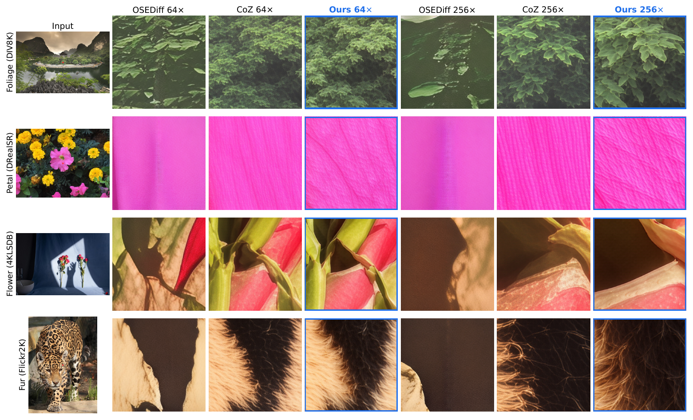
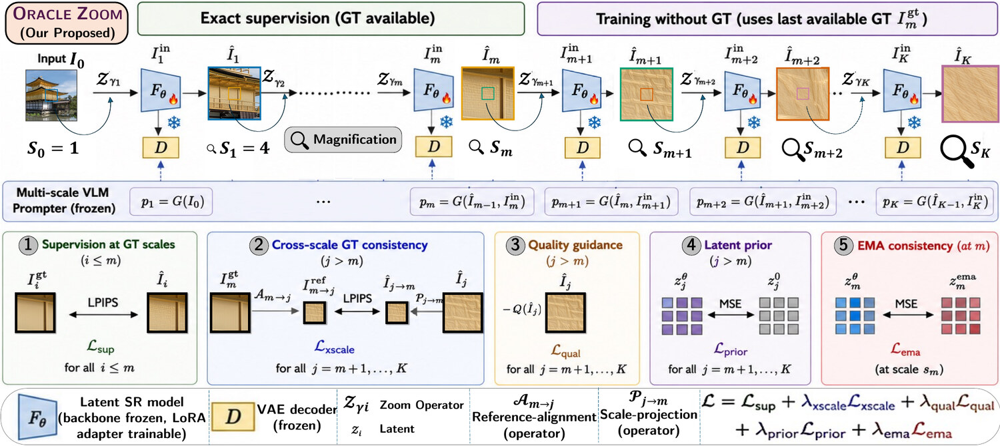

# OracleZoom

OracleZoom trains recursive super-resolution on its own predictions, using the last available ground-truth reference to constrain deeper zooms. Cross-scale alignment preserves observable structure. Quality guidance and a pretrained latent prior guide the detail that the reference cannot verify.

A rank-16 LoRA adapter adds **7.1M trainable parameters**, trained on **1,000 images**. The released checkpoint merges that adapter into the transformer. Evaluation follows four 4x zoom steps through 256x; it measures quality and consistency with available evidence, not exact recovery of unseen detail.

<p align="center"></p>

| | |
|---|---|
| 📄 Paper | Preprint coming soon |
| 🤗 Model | https://huggingface.co/dipta007/OracleZoom |
| 🤗 Training data | https://huggingface.co/datasets/dipta007/OracleZoom-4KLSDB-train |
| 🌐 Project page | https://dipta007.github.io/OracleZoom/ |

[Shubhashis Roy Dipta](https://roydipta.com)\*,
[Sourajit Saha](https://sourajitcs.github.io/)\*,
[Shaswati Saha](https://scholar.google.com/citations?hl=en&user=_pTdzsAAAAAJ&view_op=list_works&sortby=pubdate),
[Nobin Sarwar](https://smsnobin77.github.io/)
&nbsp;&middot;&nbsp; University of Maryland, Baltimore County
&nbsp;&middot;&nbsp; WACV 2027, in submission

\*Equal contribution. `{sroydip1, ssaha2, ssaha3, sms2}@umbc.edu`

---

## 1. Install

You need one NVIDIA GPU and Python 3.10 or newer. Everything runs on a single GPU.

```bash
git clone --recursive https://github.com/dipta007/OracleZoom.git
cd OracleZoom
uv sync
```

Then download the weights. One command gets everything: our merged model plus the three Chain-of-Zoom checkpoints the pipeline needs, so you do not have to fetch those separately.

```bash
uv run hf download dipta007/OracleZoom --local-dir weights/oraclezoom
```

Stable Diffusion 3-medium is gated. Accept its licence once on Hugging Face and run `uv run hf auth login`. It and Qwen2.5-VL-3B then download by themselves the first time you run.

## 2. Zoom into your own images

```bash
uv run scripts/infer.py --input my_images/ --output out/
```

That is the whole thing: it finds the weights (downloading them if needed), zooms every image four times, and writes the results. Under the hood it calls:

```bash
uv run -m opd_zoom.teacher.oracle_infer --mode student \
  --full_transformer weights/oraclezoom/merged_transformer.safetensors \
  --coz_ckpt weights/oraclezoom/ckpt \
  --gt_dir my_images/ --out out/ --rec_num 4 --upscale 4
```

The released weights are a **merged** transformer, not a LoRA adapter, so the flag is `--full_transformer`. Passing `--pld_lora` fails with `Can't find 'adapter_config.json'`.

You get four folders:

| Folder | Zoom |
|---|---|
| `out/per-scale/scale1` | 4x |
| `out/per-scale/scale2` | 16x |
| `out/per-scale/scale3` | 64x |
| `out/per-scale/scale4` | 256x |

Each input image is resized and center-cropped to 512x512, then zoomed four times. Each step returns to 512x512 before the next zoom. Pass a file to process one image, or a directory to process its PNG and JPEG images.

**That is all you need to use the model.** The rest of this page is for reproducing our numbers.

---

## 3. Results

CLIPIQA measures image quality without a reference; higher is better. LPIPS and DISTS measure agreement with ground truth; lower is better. We report direct-reference scores only at 4x, where targets are available.

| Method | CLIPIQA (mean) | LPIPS @4x | DISTS @4x | CLIPIQA @256x |
|---|---|---|---|---|
| HiT-SR | 0.414 | 0.341 | 0.222 | 0.488 |
| MambaIR | 0.428 | 0.343 | 0.224 | 0.501 |
| SwinIR | 0.456 | 0.228 | 0.175 | 0.463 |
| SeeSR | 0.546 | 0.216 | 0.164 | 0.505 |
| OSEDiff | 0.581 | 0.336 | 0.228 | 0.532 |
| Chain-of-Zoom | 0.621 | 0.215 | 0.170 | 0.579 |
| **OracleZoom** | **0.713** | **0.199** | **0.160** | **0.706** |

CLIPIQA is the mean over **7 test sets** (4KLSDB, DIV2K, DIV8K, DRealSR, FFHQ, Flickr2K, RealSR) and 4x to 256x. LPIPS and DISTS are at 4x only, averaged over the four sets whose 4x target is real detail rather than an upscale (4KLSDB, DIV8K, DRealSR, RealSR). Every method runs inside the same zoom loop and is scored by the same code, so the comparison is fair.

OracleZoom leads the aggregate LPIPS and DISTS results, but results are more mixed on DRealSR and RealSR. OSEDiff has the best aggregate NIQE. No-reference quality scores alone do not establish agreement with the observed scene.

At deeper scales, InternVL3.5-38B checks consistency with earlier zooms. It prefers OracleZoom over Chain-of-Zoom in **68% of decided comparisons at 64x** and **78% at 256x**. Ties and abstentions are excluded. Hallucination rates are 0.21 and 0.14 for OracleZoom, compared with 0.55 and 0.70 for Chain-of-Zoom.

See [REPRODUCE.md](REPRODUCE.md) for the exact settings and commands.

---

## 4. How it works

Training follows the model's own 4x to 16x predictions and backpropagates through both steps. The same adapter is reused through 256x at inference.

<p align="center"></p>

| Objective | What it does |
|---|---|
| Direct supervision | Match the decoded 4x prediction to ground truth using LPIPS. |
| Cross-scale consistency | Project the 16x prediction back to the reference resolution and match the aligned region of the 4x ground truth. |
| Quality guidance | Use frozen TOPIQ-NR to guide unresolved detail in the 16x prediction. |
| KL prior | Keep adapted latents close to the pretrained model's prediction on the same input. |
| EMA consistency | Use a slowly updated adapter copy with the ground-truth input to stabilize training at the supervision boundary. |

Removing the KL prior raises 16x CLIPIQA from 0.714 to 0.794, but worsens projected DISTS from 0.215 to 0.330 and raises judged hallucination from 0.303 to 0.907. A higher quality score can accompany more disagreement with the reference.

Ground-truth targets, the quality model, and the EMA branch are used only during training. Inference uses the learned transformer with the SR backbone, decoder, and VLM prompter.

---

## 5. Train it yourself

**Step 1: get the data.** It downloads from HuggingFace. No manual setup.

```bash
uv run scripts/prepare_data.py --tier 1k --out data/train_1k --eval_layout data/eval_val
```

This downloads the images and their cached prompts, then builds the low-quality inputs the model trains on. Use `--tier 1k` for the paper setting. `4k`, `16k` and `all` are also available.

**Step 2: train.**

```bash
scripts/train_final.sh data/train_1k data/train_1k/train_list.txt data/train_1k_val out/run1
```

The command shows all five weights, so you can read the settings instead of trusting defaults. Training stops on its own when validation stops improving. Our run stopped near 9,300 steps.

If a run stops early, add `--resume out/run1/ckpt.pt` to continue from exactly where it left off. The optimizer, step count, data order, random state, and slow-copy weights are all saved.

## 6. Score it

The `--eval_layout` folder from step 1 works right away, with nothing else to download:

```bash
scripts/eval_final.sh data/eval_val renders/ours results/ours
```

To score Chain-of-Zoom through the same pipeline, add `blind` at the end and set `ARM=blind` so the scores carry the correct label.

For the seven test sets in the paper (DIV2K, DIV8K, DRealSR, RealSR, Flickr2K, FFHQ, 4KLSDB) you need the datasets themselves, which are not ours to share:

```bash
export OPDZ_ROOT=/where/your/datasets/are
uv run scripts/prep_eval_datasets.py div8k_1238
scripts/eval_final.sh $OPDZ_ROOT/data/eval/div8k_1238 renders/ours results/ours
```

The scorer reports direct-reference LPIPS and DISTS only at 4x. Projected-reference evaluation, described on the project page, checks deeper predictions at the last available reference resolution.

---

## Thanks

Built on [Chain-of-Zoom](https://github.com/bryanswkim/Chain-of-Zoom) (the zoom loop and the prompt model) and [OSEDiff](https://github.com/cswry/OSEDiff) (the one-step SR model). Scores come from [IQA-PyTorch](https://github.com/chaofengc/IQA-PyTorch), pinned to one version.

## Cite

```bibtex
@misc{oraclezoom2026,
  title        = {OracleZoom: On-Policy Self-Distillation Inspired Reference-Constrained Recursive Image Super Resolution},
  author       = {Roy Dipta, Shubhashis and Saha, Sourajit and Saha, Shaswati and Sarwar, Nobin},
  year         = {2026},
  howpublished = {\url{https://github.com/dipta007/OracleZoom}},
  note         = {Preprint in preparation. Under submission to WACV 2027}
}
```

## License

MIT. See [LICENSE](LICENSE).
